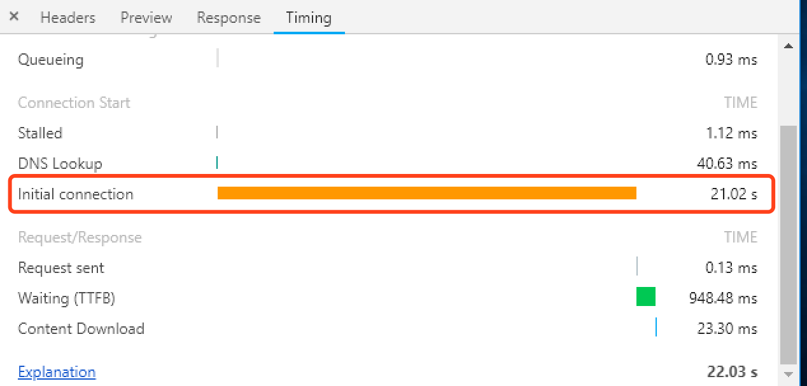
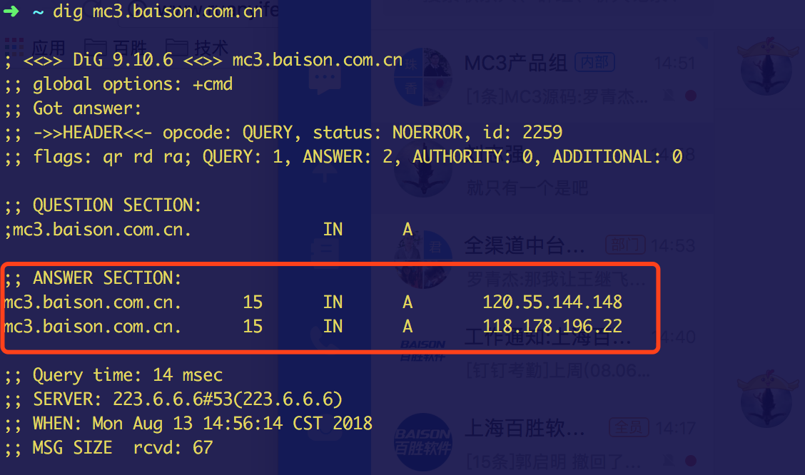

# 初始化时间很长

## 问题描述
- 域名D：www.xxx.com
- ip地址：IP_A,IP_B
```
域名D之前一直解析到IP_A，然而一天IP_A对应的服务器不可用了，就用A记录的形式解析到了IP_B，
但解析过去之后，网站访问时，如果两三分钟内不进行操作，就会出现卡顿的现象
```

## 解决问题的过程

### 服务器的问题？
- 查看服务器资源占用情况：CPU、内存、网络
```
# sar -u 1 
# sar -r 1
# sar -n DEV 1
# free -m

发现cpu并不高，但内存中很大一部分被buffer/cache给吃掉，于是清了下：
# echo 1 > /proc/sys/vm/drop_caches:表示清除pagecache。
# echo 2 > /proc/sys/vm/drop_caches:表示清除回收slab分配器中的对象（包括目录项缓存和inode缓存）。slab分配器是内核中管理内存的一种机制，其中很多缓存数据实现都是用的pagecache。
# echo 3 > /proc/sys/vm/drop_caches:表示清除pagecache和slab分配器中的缓存对象。
内存消耗立即下来了，但卡顿问题依然存在
```
- 服务器内部访问域名使用内网IP(编辑/etc/hosts)
```
域名D IP_B对应服务器的内网ip
```
- 优化nginx配置，fpm配置，服务器资源使用限制
    + nginx
    ```
    worker_connections 102400;
    keepalive_timeout 120;
    ```
    + fpm
    ```
    pm.max_requests = 500
    pm.max_children = 60
    ```
    + ulimit
    ```
    root soft nofile 655350
    root hard nofile 655350
    * soft nofile 655350
    * hard nofile 655350
    ```

- 上面一顿操作后，卡顿问题依然存在

### 初始化连接时间过长
- 通过chrome浏览器的调试功能，发现卡顿的原因是，初始化连接的时间很长
 
- 发现，DNS lookup的时间并不长，**应该？？？**不是DNS的问题，然后去网上查，说是tcp三次握手的时间长，可能是在排队等待握手，然后看tcp连接数及状态
```
# netstat -ant |grep 80
# netstat -n | awk '/^tcp/ {++S[$NF]} END {for(a in S) print a,S[a]}'

LAST_ACK 10
CLOSE_WAIT 2
ESTABLISHED 146
FIN_WAIT2 1
TIME_WAIT 2185

发现TIME_WAIT较高

```
- 然后去查[降低time_wait方法](https://blog.csdn.net/yusiguyuan/article/details/21445883)
```
打开系统的TIMEWAIT重用、快速回收及把syn请求缓存起来
# vim /etc/sysctl.conf
net.ipv4.tcp_tw_reuse = 1 
net.ipv4.tcp_tw_recycle = 1
net.ipv4.tcp_syncookies = 1

结果还是不行
```

### 特么还是DNS解析的原因！！！
- 本地ping域名D的时候，有时还是解析到原来的IP_A上，然后用dig查看了下解析过程

发现应答的A记录里面有时居然还有IP_A，然后查看了阮大师的网络日志-[DNS原理入门](http://www.ruanyifeng.com/blog/2016/06/dns.html)，说明之前IP_A还在参与解析！！
于是联系公司的域名管理人员，发现之前域名解析A记录IP_A已禁用，果断删除之，问题解决

## 总结
- DNS lookup的时间短是因为，确实很快找到了A记录，但是有两个，客户端会逐个的去访问，找到能访问的其中一个，但IP_A不能访问，这样就浪费了很长时间


