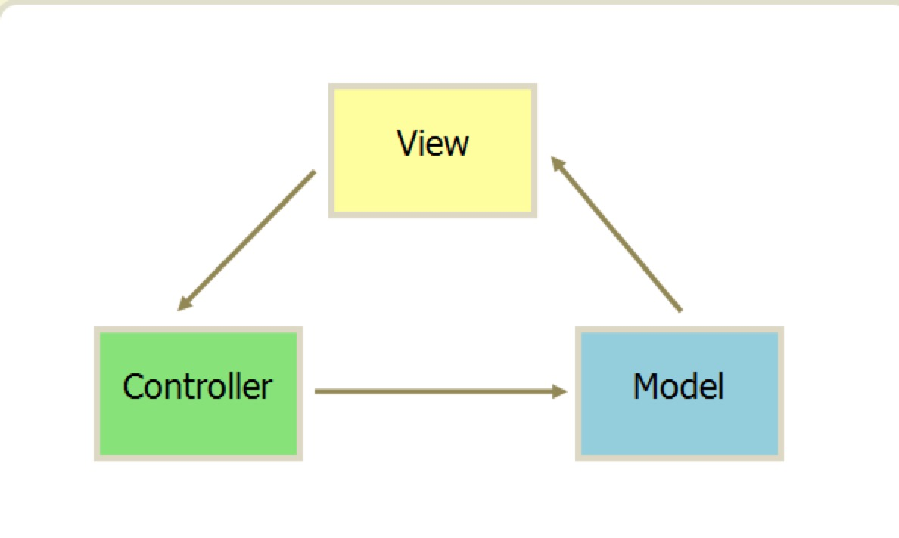
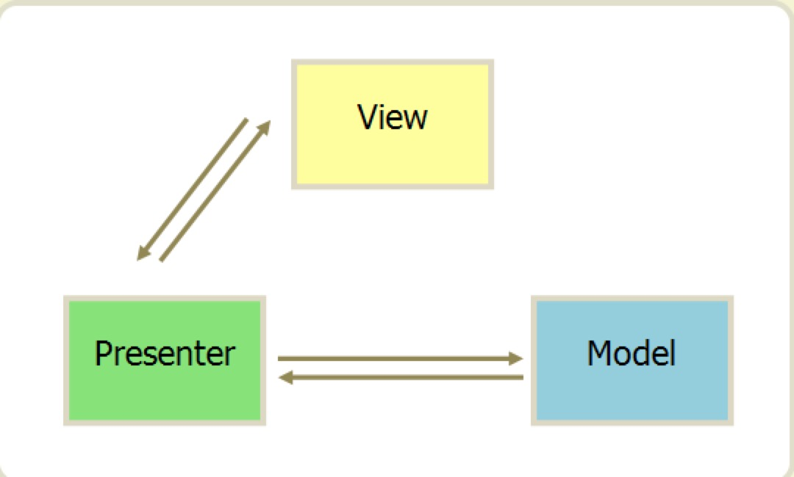
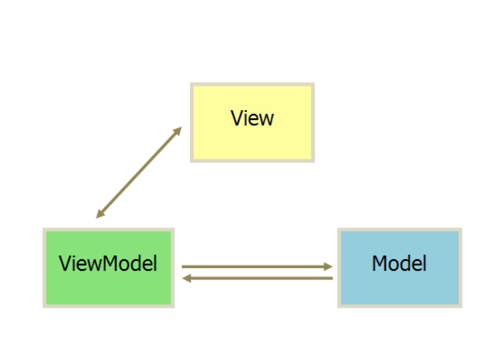
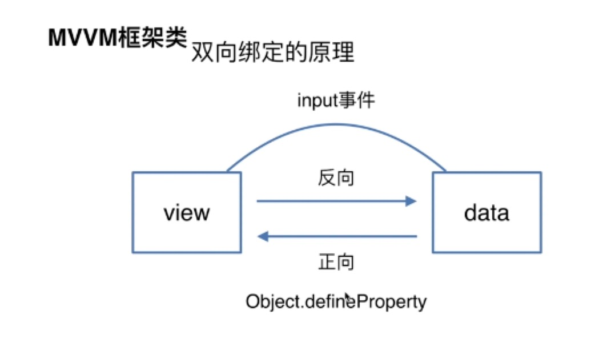
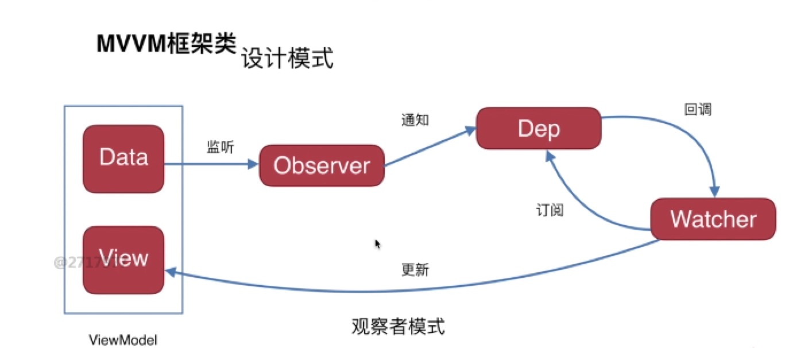
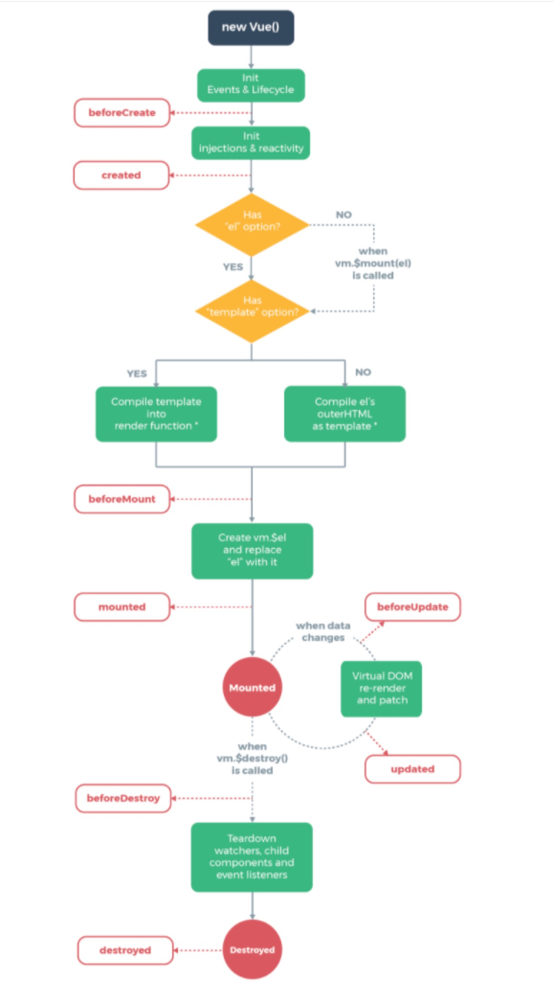

# MVVM框架

## 框架
- Vue
- React
- Angular

## MVVM vs MVC vs MVP
- MVC: 
     
    + 所有通信都是`单向`的
    + View传递用户指令到Controller
    + Controller完成业务逻辑后，要求Model改变状态
    + Model将新的数据发送到View，用户得到反馈
- MVP: 
     
    + MVP模式将Controller改名为Presenter，同时改变了通信方向。
    + 各部分之间的通信都是双向的
    + View与Model不发生联系，都通过Presenter传递
    + View非常薄，不部署任何业务逻辑，被称为“被动视图”,即没有任务主动性，而Presenter非常厚，所有逻辑都部署在那里
- MVVM: 
     
    + 基本与MVP模式一致
    + 唯一区别是，采用`双向绑定`，View的变动，`自动`反映在ViewModel，反之亦然    

## 双向绑定原理

- 原理：
    + 正向：data -> view,数据驱动页面(入职前的模板引擎)
    + 反向：view -> data,页面数据改变驱动数据改变(如监听input事件)
    + 绑定：数据改变`自动`完成
- 核心API: Object.defineProperty(obj, prop, descriptor) 
    + obj: 要在其上定义属性的对象
    + prop: 要定义或修改的属性名称
    + descriptor: 属性描述符，包含数据描述符和存取描述符,二者不可共存，否则会报异常
        - 数据描述符/存取描述符共有：
            + configurable: 
                - true, 该属性描述符可改变，且该属性可从对象上删除
                - false, 默认
            + enumerable: 
                - true, 该属性能出现在对象的枚举属性中，for(var i in obj){xxx}
                - false, 默认
        - 数据描述符
            + value: 该属性对应的值，可以是任何有效js值（数值，对象，函数等）,默认为undefined
            + writable: 
                - true, 可被赋值运算符改变
                - false, 默认
        - 存取描述符
            + get: 一个给属性提供getter的方法，若没有getter，则为undefined，方法返回值用作属性值，默认undefined
            + set: 一个给属性提供setter的方法，若没有setter，则为undefined，方法接受唯一参数，并将该参数的新值分配给该属性，默认undefined
```javascript
var o = {}; // 创建一个新对象

// 在对象中添加一个属性与数据描述符的示例
Object.defineProperty(o, "a", {
  value : 37,
  writable : true,
  enumerable : true,
  configurable : true
});

// 对象o拥有了属性a，值为37

// 在对象中添加一个属性与存取描述符的示例
var bValue;
Object.defineProperty(o, "b", {
  get : function(){
    return bValue;
  },
  set : function(newValue){
    bValue = newValue;
  },
  enumerable : true,
  configurable : true
});

o.b = 38;
// 对象o拥有了属性b，值为38

// o.b的值现在总是与bValue相同，除非重新定义o.b

// 数据描述符和存取描述符不能混合使用
Object.defineProperty(o, "conflict", {
  value: 0x9f91102, 
  get: function() { 
    return 0xdeadbeef; 
  } 
});
// 会报异常
```

## 设计模式(观察者模式)

+ Data + View => ViewModel
+ Observer: 监听者，会监听Data的变化，然后通知所有的观察者列表, 会添加观察者
+ Dep: 观察者列表，自动回调各自update函数
+ Watcher: 订阅,添加观察者，且更新View 


## 生命周期

- beforeCreate:  组件实例刚被创建，组件属性（如data）计算之前(el 和 data 并未初始化 )
- created:       组件实例创建完成，属性已绑定，但DOM还未生成，$el属性还不存在(完成了 data 数据的初始化，el没有)
- beforeMounted: 模板编译/挂载之前(完成了 el 和 data 初始化 )
- mounted:       模板编译/挂载之后(完成挂载，页面渲染)
- beforeUpdate:  组件更新之前（虚拟DOM,diff比对，重新渲染之前）
- updated:       组件更新之后
- beforeDestroy: 组件销毁前调用（可用app.$destroy()进行销毁）
- destroyed:     组件销毁之后调用（组件销毁后，原先生成的DOM元素依然存在，只是不再受vue控制了）


