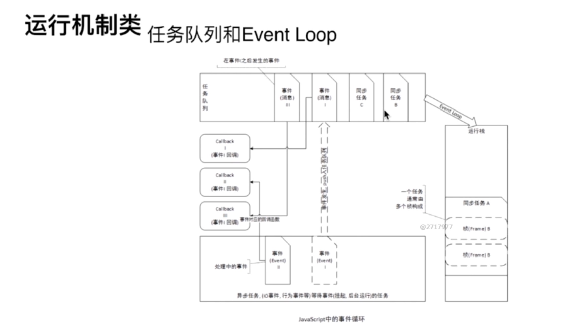

# JS运行机制

## JS单线程
- 一个时间内JS只能做一件事情

## 任务队列
- 同步任务
- 异步任务
    + setTimeout和setInterval
    + DOM事件
    + ES6中的Promise
- 先执行同步任务, 在执行异步任务

## 事件循环（Event Loop）

1. 浏览器在执行js时，将同步任务放入运行栈中
2. 异步任务会被保留，如setTimeout，到时间后，timer模块会把它放入异步任务队列中去
3. 运行栈中的同步任务全都执行完后，js引擎会将异步任务队列中的任务放入运行栈中去执行
4. 如此循环