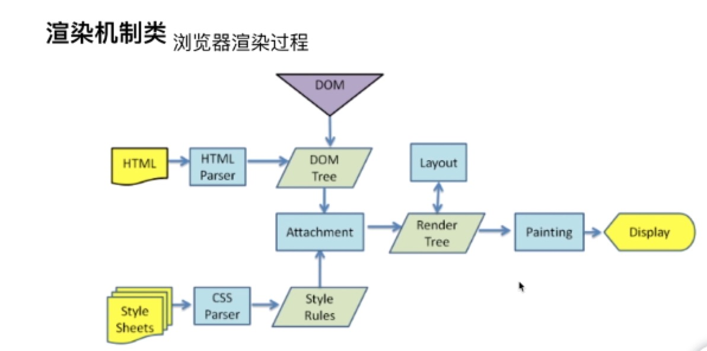

# 渲染机制

## DOCTYPE及作用 
- DTD(文档类型定义)是一系列语法规则，用来定义XML或(X)HTML的文件类型，浏览器会使用它来判断文档类型，来决定使用哪种协议来解析以及切换浏览器模式
- DOCTYPE是用来声明文档类型和DTD规范的，一个主要用途就是文件的合法性验证，如果不合法，则浏览器解析时便会出错
- 常见的DOCTYPE
    + HTML5: <!DOCTYPE html>
    + HTML4.01 Strict: 严格模式,包含所有HTML元素和属性，但不包括展示性和弃用的元素（如font）
    + HTML4.01 Transitional: 传统（宽松）模式,包含所有HTML元素和属性

## 浏览器渲染过程

1. 浏览器拿到html和样式表
2. html经过html解析器解析为dom tree
3. 样式表经过css解析器解析为cssom(css object model) tree
4. 将dom tree 和 cssom tree 结合，变为render tree (要渲染的结构，但不知道元素的具体位置)
5. 通过layout计算出render tree中各元素的精确位置
6. 使用GUI开始绘制页面（painting）
7. 展示给用户（display）

## 重排reflow
- 定义： DOM结构中的各个元素都有自己的盒子（模型），这些都需要浏览器根据各种样式来计算并根据计算结果将元素放到该出现的位置，这个过程称之为reflow
- 触发reflow
    + 增加、删除、修改DOM节点
    + 移动DOM元素位置，或者做动画
    + 修改css样式
    + resize窗口（移动端没有这个问题）,或是滚动
    + 修改网页默认字体（`很耗性能`）

## 重绘repaint
- 定义： 当各种元素的位置大小以及其他属性，如颜色、字体大小等都确定下来后，浏览器便把这些元素都按照各自的特性绘制了一遍，这个过程称之为repaint
- 触发repaint
    + DOM改动
    + CSS改动
- 如何减少repaint
    + 需要创建多个节点是，不要逐个的添加节点，可以先创建一个片段，将多个节点放入片段中，然后一次将这个片段放到DOM中
    